# Trading Sniper Panel — Guía de Admin (ES)

Esta guía ayuda a admins de clientes e internos a gestionar el catálogo, suscripciones y accesos desde ActiveAdmin.

## Tabla de contenidos
1. Acceso + navegación básica
2. Mapa de datos (cómo se conectan)
3. Expert Advisors (EAs)
4. Bundles de EA
5. Add-ons de EA (compra única)
6. Cursos
7. Módulos + lecciones
8. Add-ons de cursos (compra única)
9. Assets de marketplace
10. Productos de marketplace (compra única)
11. Planes de billing (suscripciones)
12. Entitlements de planes (EA/Curso/Asset)
13. Facturación manual (transacciones + suscripciones)
14. Usuarios
15. Reglas + pagos de revenue split
16. Checklists de lanzamiento
17. Solución de problemas

---

## 1) Acceso + navegación básica
- **URL admin**: `/admin` (requiere cuenta admin).
- **Idioma**: usa el locale preferido del usuario; hay soporte EN/ES.
- **Filtros**: cada pantalla tiene filtros en la barra lateral para búsqueda y segmentación.
- **Acciones**: usa `New`, `Edit`, `Delete` y acciones masivas.
- **Subidas**: archivos/imágenes se guardan con Active Storage; siempre guarda después de adjuntar.

Captura:
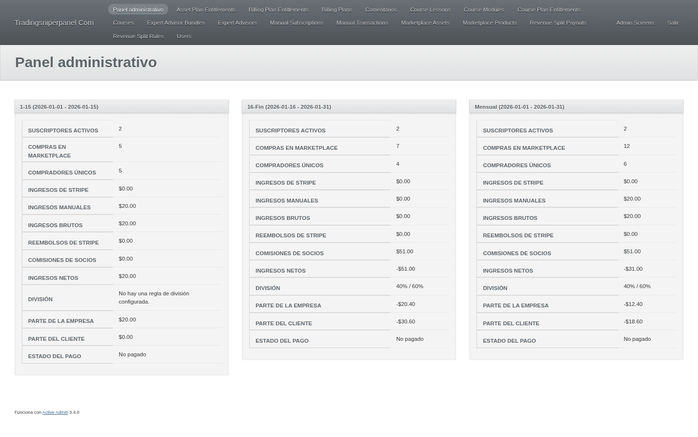

---

## 2) Mapa de datos (cómo se conectan)
- **Expert Advisors** se conectan a **Billing Plans** vía **Plan Entitlements** (suscripciones) y a **Marketplace Products** para venta one‑time.
- **Marketplace Products** crean **Billing Plans (one-time)** automáticamente y pueden dar acceso a EAs, Cursos o Assets.
- **Add-ons** son Marketplace Products que extienden un EA/Curso/Asset.
- **Cursos** tienen **Módulos** y **Lecciones**, y pueden venderse por suscripción o compra única.
- **Marketplace Assets** son descargables one‑time (PDFs, plantillas, etc.).
- **Entitlements** existen en tres pantallas: Billing Plan Entitlements, Course Plan Entitlements y Asset Plan Entitlements.

Captura:

---

## 3) Expert Advisors (EAs)
**Dónde:** Admin → Expert Advisors

**Crear un EA**
1. Click en `New Expert Advisor`.
2. Completa: nombre, descripción, tipo (EA/tool/indicator/script), tier rank (orden), trial enabled, tags.
3. Sube el archivo del EA (`ea_files`).
4. Agrega guías EN/ES en la sección “Guides”.
5. Guarda.

**Tips**
- `ea_id` se genera automático y no se puede cambiar.
- Usa tags para filtros y descubrimiento.

Captura:
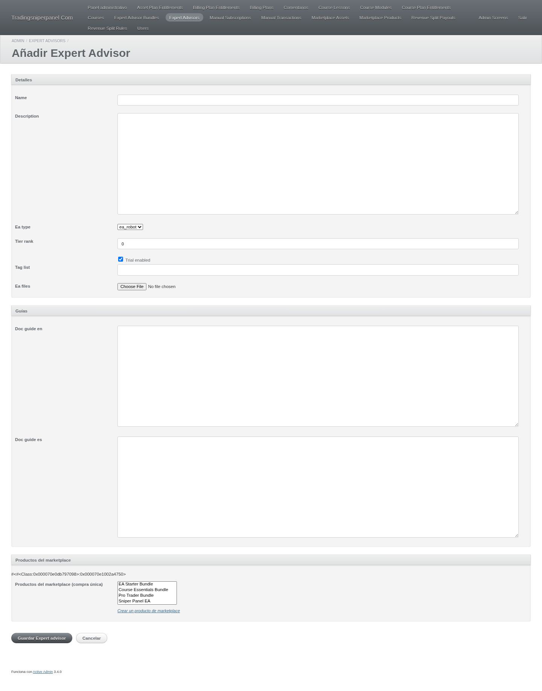

---

## 4) Bundles de EA
**Dónde:** Admin → Expert Advisor Bundles

Los bundles mapean combinaciones de add-ons a archivos descargables.

**Crear un bundle**
1. Click en `New Expert Advisor Bundle`.
2. Selecciona el Expert Advisor.
3. Ingresa las claves de add-ons requeridas (separadas por coma). El `bundle_key` se calcula solo.
4. Sube el archivo del bundle y configura active/sort order.
5. Guarda.

**Por qué importa**
Si vendes add-ons, cada combinación requerida debe tener un bundle. El panel del EA muestra cobertura y faltantes.

Captura:
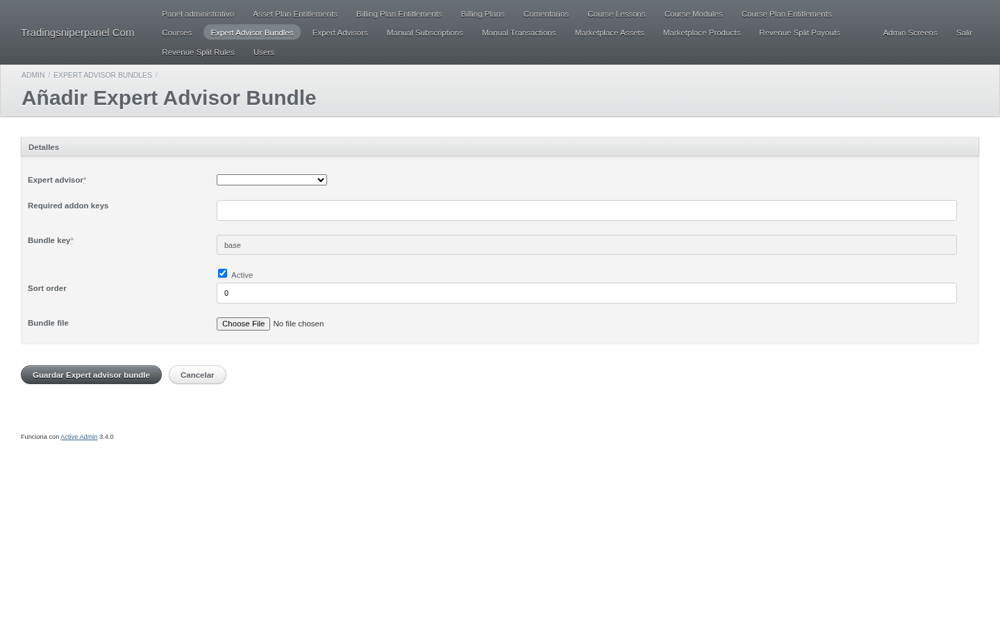

---

## 5) Add-ons de EA (compra única)
**Dónde:** Admin → Marketplace Products

Los add-ons son Marketplace Products que extienden un EA específico.

**Crear un add-on de EA**
1. Click en `New Marketplace Product`.
2. Completa detalles del producto (slug, status, sort order, título, resumen, descripción, imagen).
3. Configura precios (monto, moneda, IDs de Stripe si aplica).
4. En **Add-on**, elige el EA objetivo y la clave del add-on.
5. Guarda.

**Después de guardar**
- El add-on queda vinculado al EA y afecta la cobertura de bundles.

Captura:

Diagrama:
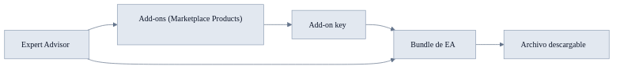

---

## 6) Cursos
**Dónde:** Admin → Courses

**Crear un curso**
1. Click en `New Course`.
2. Define slug, status, category, position y fecha de publicación.
3. Agrega título/resumen/descripción EN/ES.
4. Agrega tags.
5. Guarda.

**Tip**: deja `status` en `draft` hasta completar módulos/lecciones.

Captura:
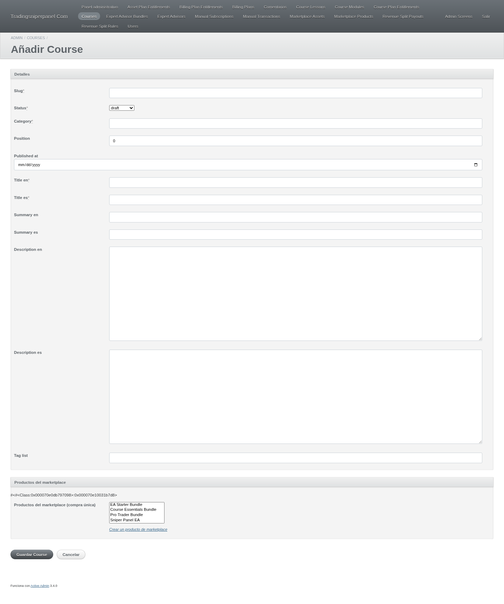

---

## 7) Módulos + lecciones
**Dónde:** Admin → Course Modules / Course Lessons

**Crear módulos**
1. Course Modules → `New`.
2. Selecciona curso, posición, título y resumen.
3. Guarda.

**Crear lecciones**
1. Course Lessons → `New`.
2. Selecciona módulo, posición/título/resumen.
3. Agrega cuerpo (Markdown), Stream UID, duración.
4. Guarda.

Capturas:
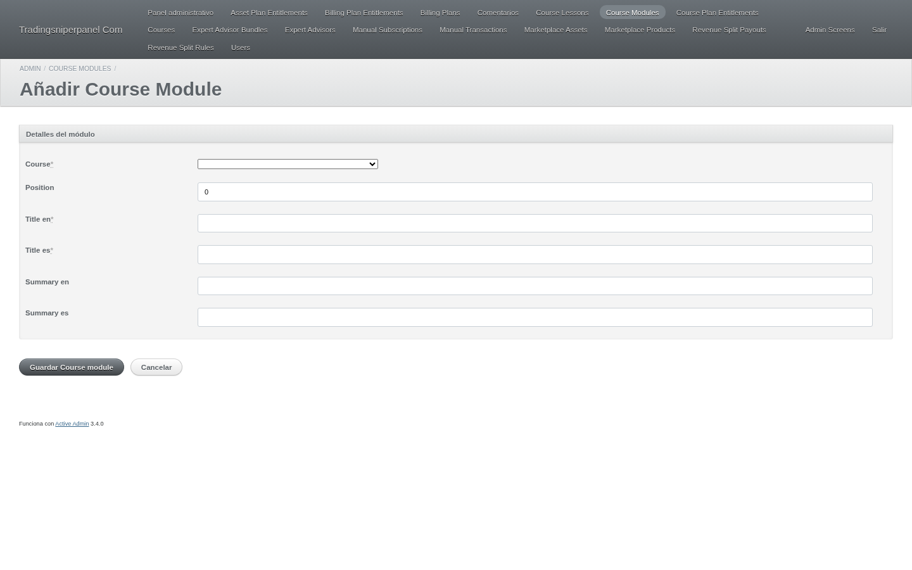
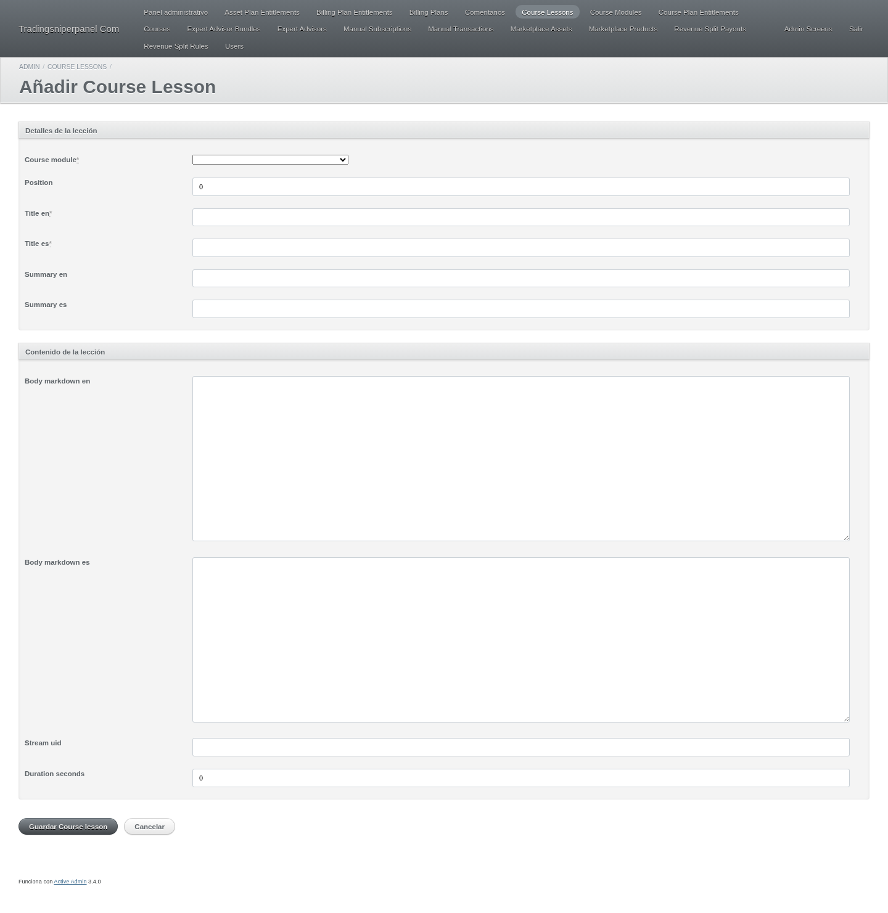

---

## 8) Add-ons de cursos (compra única)
**Dónde:** Admin → Marketplace Products

**Crear un add-on de curso**
1. Crea un Marketplace Product.
2. En **Entitlements**, selecciona el curso.
3. (Opcional) En **Add-on**, elige el curso y la clave del add-on.
4. Guarda.

Captura:
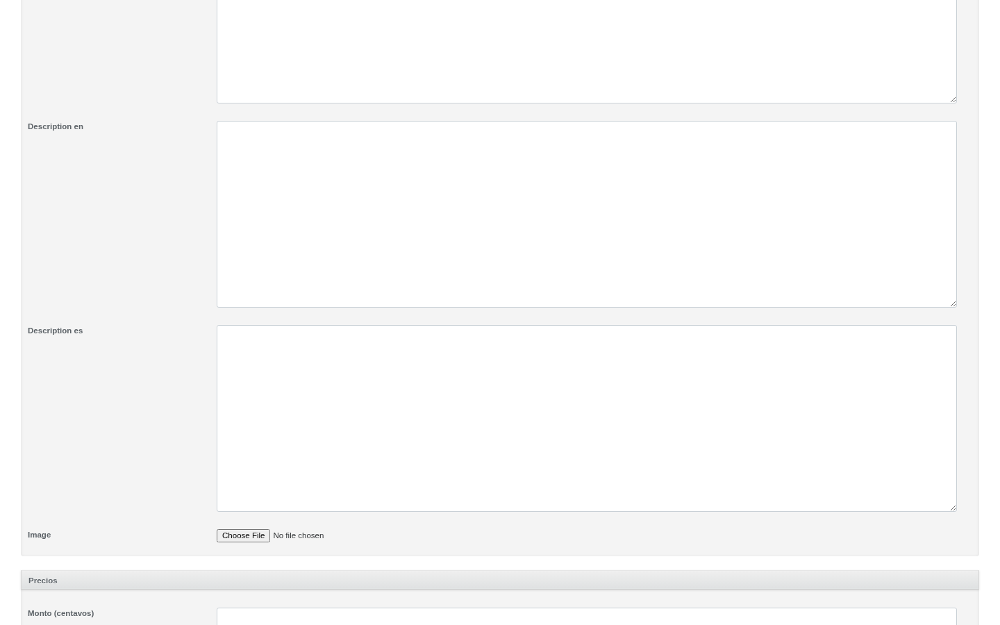

---

## 9) Assets de marketplace
**Dónde:** Admin → Marketplace Assets

**Crear un asset**
1. Click en `New Marketplace Asset`.
2. Define slug, status y sort order.
3. Completa título/resumen/descripción EN/ES.
4. Sube el archivo.
5. Guarda.

Captura:
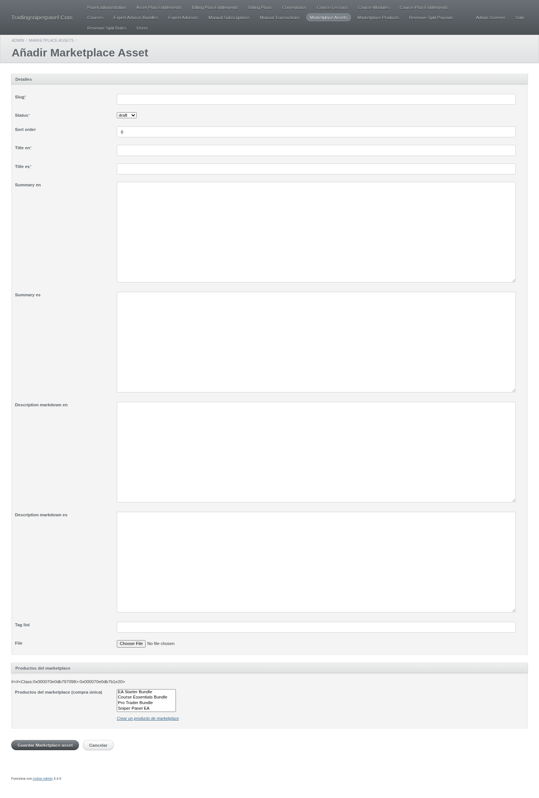

---

## 10) Productos de marketplace (compra única)
**Dónde:** Admin → Marketplace Products

Estos productos crean un Billing Plan one‑time y otorgan acceso.

**Crear un producto**
1. Click en `New Marketplace Product`.
2. Completa detalles (incluyendo status/sort order) e imagen.
3. Configura precio (monto/moneda + IDs de Stripe si aplica).
4. Agrega **Entitlements** (EA/Curso/Asset).
5. Configura **Add-on** solo si extiende otro item.
6. Guarda.

**Notas**
- Este flujo crea un Billing Plan one‑time automáticamente.
- Para add-ons de assets, primero debe existir un producto base del asset.

Captura:
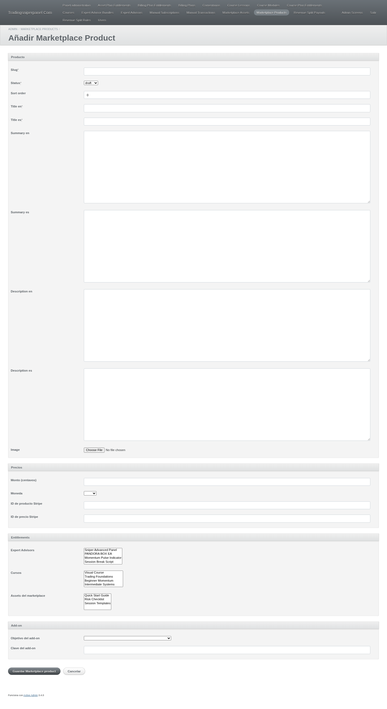

---

## 11) Planes de billing (suscripciones)
**Dónde:** Admin → Billing Plans

**Crear un plan de suscripción**
1. Click en `New Billing Plan`.
2. Define key (debe coincidir con `tier_interval`, ej. `basic_monthly`).
3. Completa name, kind `subscription`, tier, interval, interval count, amount, currency, active, sort order.
4. Agrega IDs de Stripe si aplica.
5. Guarda.

**Nota**
- Los planes de suscripción requieren `tier`, `interval` y `interval_count`.
- Cambiar precio/intervalo puede crear un nuevo precio en Stripe.

Captura:
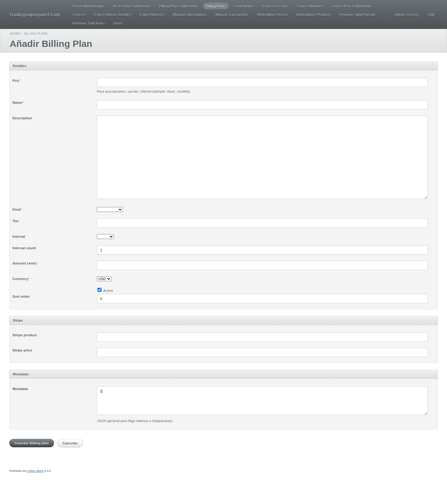

Diagrama:
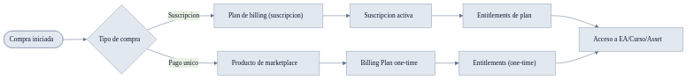

---

## 12) Entitlements de planes (EA/Curso/Asset)
**Dónde:** Admin →
- Billing Plan Entitlements (EAs)
- Course Plan Entitlements (Cursos)
- Asset Plan Entitlements (Assets)

**Crear un entitlement**
1. Click en `New`.
2. Selecciona el Billing Plan y el EA/Curso/Asset.
3. Guarda.

**Flujo recomendado**
1. Crea o confirma Billing Plans.
2. Agrega entitlements para cada plan de suscripción.
3. Para productos one‑time, gestiona entitlements desde el formulario de Marketplace Product.
4. Verifica acceso en el dashboard.

Captura:
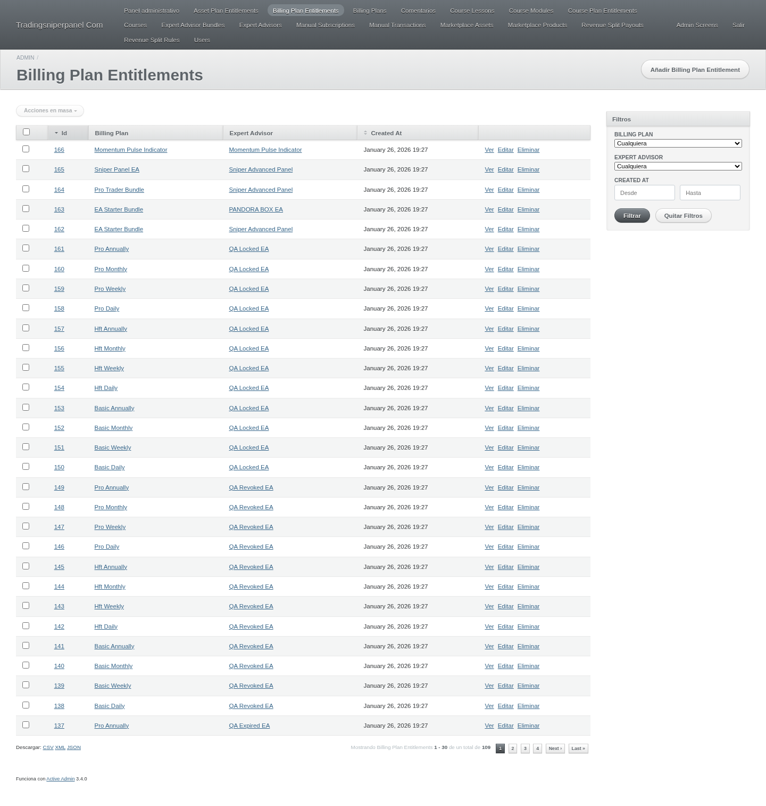

Diagrama:
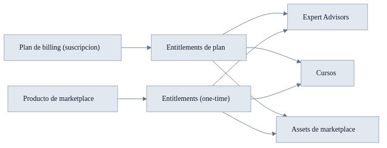

---

## 13) Facturación manual (transacciones + suscripciones)
**Dónde:** Admin → Manual Transactions / Manual Subscriptions

**Transacción manual (one‑time)**
1. `New Manual Transaction`.
2. Selecciona usuario + plan one‑time.
3. Completa monto, moneda, fecha de pago, método y referencia.
4. Guarda.

**Suscripción manual**
1. `New Manual Subscription`.
2. Selecciona usuario + plan de suscripción.
3. Completa fechas, estado, método, referencia.
4. Guarda.

Captura:
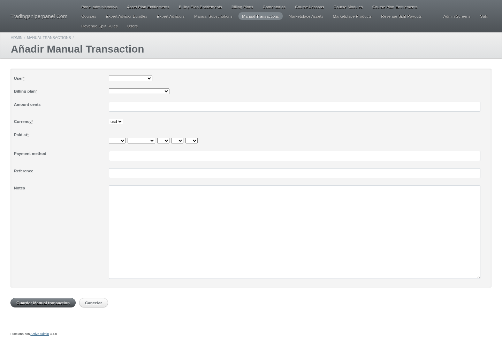

---

## 14) Usuarios
**Dónde:** Admin → Users

- Configura email, nombre, idioma preferido y zona horaria.
- Contraseña solo al crear.

**Nota**
Los cambios de rol requieren soporte interno. Si no ves un botón, contacta al equipo interno.

Captura:
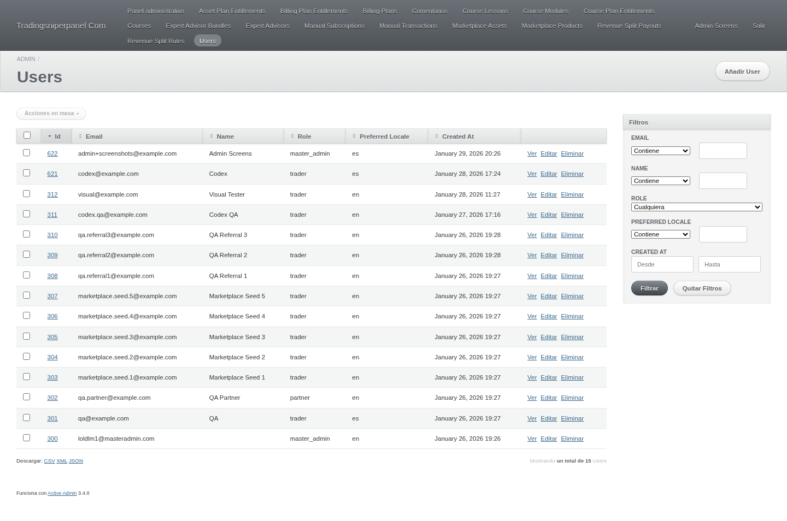

---

## 15) Reglas + pagos de revenue split
**Dónde:** Admin → Revenue Split Rules / Revenue Split Payouts

- **Reglas**: definen porcentajes de empresa/cliente.
- **Pagos**: registran pagos por período.

Captura:
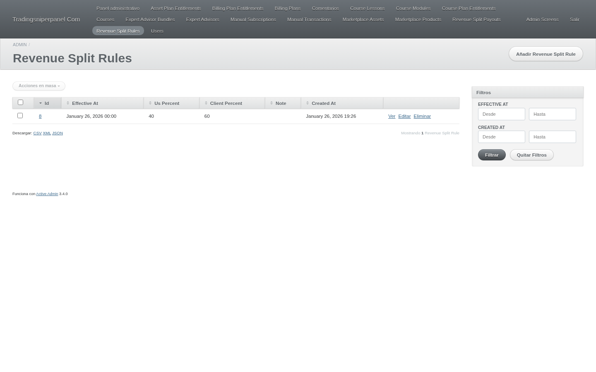

---

## 16) Checklists de lanzamiento

### A) Lanzar un EA
1. Crear el Expert Advisor.
2. Subir archivo y guías.
3. Crear add-ons en Marketplace Products (si aplica).
4. Agregar bundles requeridos.
5. Vincular entitlements a planes de suscripción.

### B) Publicar un curso
1. Crear el curso.
2. Agregar módulos y lecciones.
3. Crear Marketplace Product (one‑time) si aplica.
4. Vincular entitlements a planes de suscripción.

### C) Lanzar un producto de marketplace
1. Crear el Marketplace Product con pricing.
2. Asignar entitlements.
3. Configurar add-on si es una extensión.

---

## 17) Solución de problemas
- **No aparece en el dropdown**: confirma que el registro existe y está activo.
- **Bundles faltantes**: agrega los bundles necesarios.
- **Error de asset add-on**: primero crea el producto base del asset.
- **Curso no visible**: confirma `published` y `published_at`.
- **Errores de Stripe**: valida `STRIPE_PRIVATE_KEY` y los IDs.

---

## Apéndice: lista de capturas (ES)
Ubicar en `saas_admin_guide/images/`
- `es-01-admin-dashboard.png`
- `es-02-data-map.png`
- `es-03-expert-advisor-form.png`
- `es-04-ea-bundles.png`
- `es-05-ea-addon-product.png`
- `es-06-course-form.png`
- `es-07-course-modules.png`
- `es-08-course-lessons.png`
- `es-09-course-addon.png`
- `es-10-marketplace-asset.png`
- `es-11-marketplace-product.png`
- `es-12-billing-plans.png`
- `es-13-plan-entitlements.png`
- `es-14-manual-billing.png`
- `es-15-users.png`
- `es-16-revenue-splits.png`
